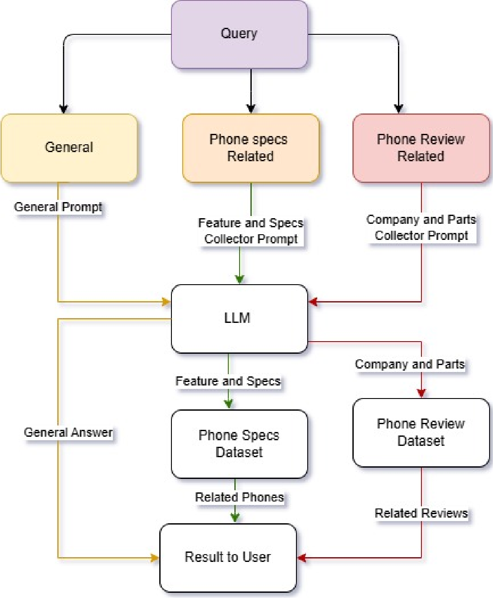

# 📱 Phone Recommender ChatBot

An interactive web-based chatbot that gives personalized phone recommendations and review summaries based on user input. Supports English and Arabic. Built using HTML, CSS, JS, Bootstrap, and CSV datasets.

---

## 🔥 Features

- 📊 Recommends phones based on user-defined specs (RAM, battery, screen, etc.)
- 💬 Displays user reviews from a CSV dataset
- 🌐 Supports English + Arabic (RTL compatible)
- 💾 Local chat saving & loading (via browser localStorage)
- 🧠 Smart prompt logic for parsing input and guiding conversation (powered by DeepSeek LLM or any compatible model)
- 📈 Responsive UI with smooth UX

---

## 🧠Technologies Used

- **Frontend**: HTML, CSS, JavaScript
- **UI Framework**: Bootstrap
- **Icons**: Font Awesome
- **CSV Parsing**: PapaParse
* **Markdown Rendering**: Marked.js
- **OpenRouter API** (DeepSeek LLM or other GPT-compatible model)

---

## 📂 File Structure

```plaintext
📁 project-root/
├── index.html            # Main UI layout
├── style.css             # Custom styles
├── main.js               # App entry + data loading
├── chat.js               # Chat history + localStorage logic
├── language.js           # Bilingual UI + dynamic translation
├── recommendation.js     # Core logic for phone suggestions
├── review.js             # Review parsing + summarization
├── mobiles.csv           # Phone data
├── reviews.csv           # User review data
```
---

### 🧭 Query Flow Overview

Here’s how the system handles a user query:

<p align="center">
  
</p>

1. **Query Classification:**  
   The system first classifies input as:  
   - General question  
   - Phone spec-related  
   - Phone review-related

2. **Prompting the LLM:**  
   - General queries use a lightweight assistant-style prompt.  
   - Spec/review queries trigger structured prompts to extract exact device specs or target features.

3. **Local Dataset Match:**  
   Extracted info is matched against:
   - `Phone Specs Dataset` for recommendations
   - `Phone Review Dataset` for review summaries

4. **Response Generation:**  
   - The result is then formatted and returned to the user with minimal latency.

This flow keeps things fast, localized, and easy to swap LLM providers.

---

## 🚀 Getting Started

1. **Clone the repo:**

```bash
git clone https://github.com/your-username/phone-recommender-chatbot.git
cd phone-recommender-chatbot
```

2. **Run locally:**

Open `index.html` directly in your browser.

> ⚠️ Some browsers (like Chrome) block local CSV access unless served over HTTP. Use a local server:
```bash
npx serve .
# or
python3 -m http.server
```

3. **Set your API key:**

Replace the `apiKey` in `main.js`:

```js
const apiKey = 'sk-or-...'; // Replace with your OpenRouter API key
```
* You can get a free API key from the OpenRouter Website.
---

## 🌍 Language Support

Switch between English and Arabic using the buttons at the top of the UI. The layout adjusts automatically (RTL for Arabic).

---

## 🧪 Example Prompts

- “I need a phone with 8GB RAM and a great camera.”
- “ما أفضل هاتف ببطارية قوية؟”
- “Review for iPhone 15 Pro”
- “How’s the camera on Galaxy S24?”

---

## 💬 Chat Management

- 💾 Save chats to localStorage
- 📂 Load and continue past conversations
- 🗑️ Delete saved chats

---

## 🛠️ Notes

- All logic is handled client-side (no backend required)
- Modular JS structure
- Dynamic feature extraction and review summarization using LLM
- CSV parsing done with PapaParse
- Easily switch to another LLM by replacing the API key and endpoint

---

## 🧠 LLM & Data Architecture

📦 **Local Dataset:**  
All recommendations and reviews come from structured local files — `mobiles.csv` and `reviews.csv`. No third-party data is fetched.

🧠 **Natural Language Understanding:**  
Queries are interpreted using **DeepSeek** LLM via the OpenRouter API. The model helps parse and respond in natural language, but **never supplies external data**.

🔧 **Plug & Play with Any Model:**  
You can replace DeepSeek with **any OpenAI-compatible LLM** by swapping the API key and endpoint in `main.js`. The architecture is model-agnostic.

---

## 👥 The Team

- **Moath AbdAlbaqi** , **Suhaib Sawalha**, **Khaled Rimawi**, **Deya Hajaj**.


